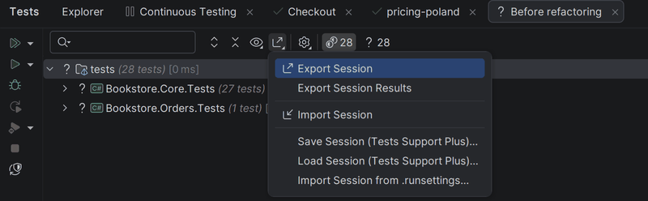
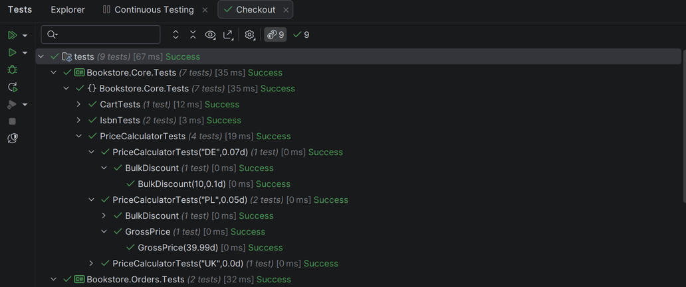
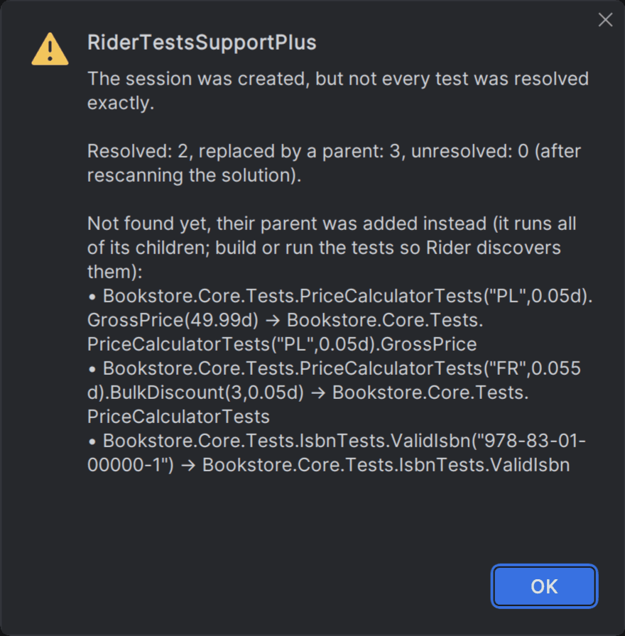
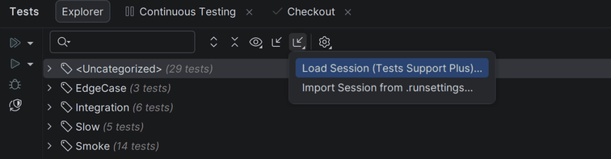
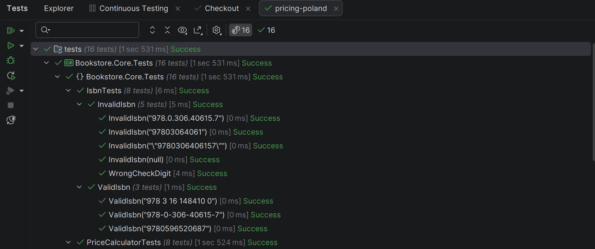

# Rider Tests Support Plus

Rider plugin by Łukasz Mastalerz that adds to the **Unit Tests** window what the built-in one lacks.
Everything else in the window keeps working as before.

> The source of truth is [eu.buddy.works/lakasabasz/ridertestssupportplus](https://eu.buddy.works/lakasabasz/ridertestssupportplus).
> The GitHub repository is a read-only mirror, updated on every push; changes made there are overwritten.

## Features

- **Save / Load Session** (`.rtsession`, JSON), including parametrized tests such as `TestClass(A).TestName(X)`.
  Tests are resolved by name after loading, so a session survives a changed project GUID or target framework.
  Missing tests trigger a rescan of the solution, then fall back to their nearest parent (method or class),
  and anything not resolved exactly is reported.
- **Import Session from `.runsettings`**: the session holds exactly the tests `dotnet vstest` would run with the file.
  - `RunConfiguration/TestCaseFilter` is evaluated by `dotnet vstest --ListFullyQualifiedTests`
    (for NUnit projects `Category` is treated as `TestCategory`, as NUnit3TestAdapter does).
  - `NUnit/Where` is evaluated by the NUnit engine of the test project (vstest's listing ignores it).
    With both present, `TestCaseFilter` wins, as in an actual run.
- Import and rescan run as background tasks with progress and cancellation.

## Usage

In the **Unit Tests** tool window open a session tab and use its *Export/Import* menu:

| Action | What it does |
|---|---|
| *Save Session (Tests Support Plus)…* | Saves the tests of the session to a `.rtsession` file |
| *Load Session (Tests Support Plus)…* | Opens a session from a `.rtsession` file, resolving its tests by name |
| *Import Session from .runsettings…* | Creates a session from the tests the file selects |





Tests that no longer exist are replaced by their nearest parent and reported
(demo/Bookstore/sessions/outdated.rtsession):



*Load Session* and *Import Session from .runsettings* are also in **Explorer**: in the drop-down right after
its *Import Session* button and in the context menu of the test tree.



Import lists the build output of the active configuration, so build the test projects first;
the report says which assembly (and from when) the tests were listed from.



To try it out, open the demo solution [demo/Bookstore](demo/Bookstore/README.md): parametrized NUnit tests,
ready `.rtsession` files and `.runsettings` files, each with the scenario it shows.

## Requirements

- Rider 2026.2 (build 262)
- NUnit 3/4 test projects
- For `NUnit/Where`: .NET (Core) test projects referencing NUnit3TestAdapter

## Build and install

Requires JDK 25 and the .NET SDK.

```
./gradlew buildPlugin
```

Install `output/ReSharperPlugin.RiderTestsSupportPlus-<version>.zip` in Rider via
*Settings → Plugins → ⚙ → Install Plugin from Disk…* and restart Rider.

The version is `PluginVersion` in `gradle.properties`; bump it for every build you install.
The newest section of [CHANGELOG.md](CHANGELOG.md) becomes the release notes.

## Tests

```
./gradlew test
```

Starts a headless Rider with the plugin (Rider's integration test framework), opens
`src/test/testData/solutions/SampleTests` (NUnit 4), builds it and drives the plugin's flows through its protocol model.

## Project layout

| Path | Content |
|---|---|
| `src/dotnet/ReSharperPlugin.RiderTestsSupportPlus` | Backend (C#): test resolution, session files, `.runsettings` import, actions |
| `src/rider/main` | Frontend (Kotlin): proxy actions in the Unit Tests window, `plugin.xml` |
| `src/tools/RiderTestsSupportPlus.NUnitLister` | Helper that lists tests selected by `NUnit/Where` with the NUnit engine |
| `protocol` | RD protocol model (used by the integration tests) |
| `src/test` | Integration tests and the sample solution |
| `demo/Bookstore` | Demo solution for trying the plugin and taking screenshots |

Design decisions and findings: [DESIGN.md](DESIGN.md).

## License

[MIT](LICENSE)
